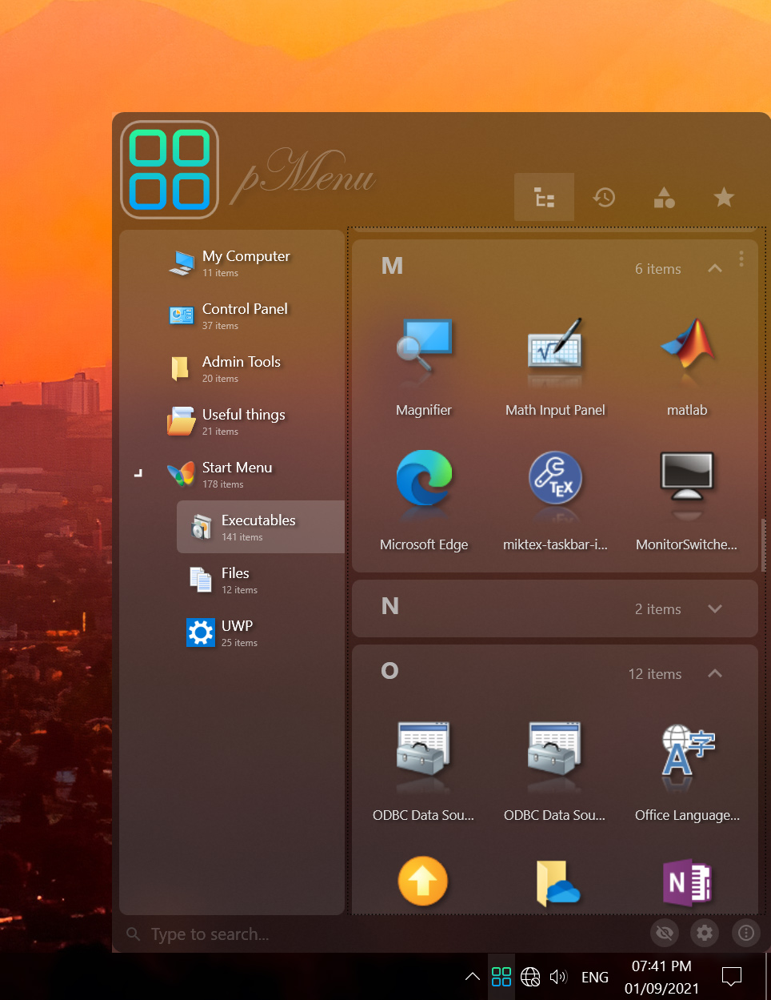

# pMenu (Under development)

pMenu is a free, open source, portable, modern, customizable start menu alternative.

# Features

- Supported links:
  - classical Win32 applications.
  - modern UWP apps.
  - shell objects (like control panel).
  - web links (you can set up your portable favorites).
  - usual files.
- Relative path support, useful for links to portable apps.
- Categories of unlimited hierarchy depth.
- individual Grouping and sorting for each category\view.
- Full drag and drop support, custom ordering.
- Custom icons to any item. Custom avatar.
- Search, recent apps, most used, favorite apps.
- Broken items are detected, and can be hidden instead of deleting them, so they will be available again when you reinstall/de-archive the program.
- Auto run pMenu, and auto run apps of custom time delay after menu start.
- Set apps to run as administrator, without the need to indicate the admin password every time.
- Animations, icon reflections, and shadows for your eye please.

# Participating

Currently the app is under development, meanwhile, any comments and suggestions are welcomed on the issue page 😊.

# Credits

The application is a WPF project built using C# and .Net Core v3.1 framework.

And it exists thanks to the following great libraries:

- Windows-API-Code-Pack (stripped out)

  v3.3 (07.17.2021)

  > https://github.com/pierresprim/Windows-API-Code-Pack

- FluentWPF

  v0.9.0

  > https://github.com/sourcechord/FluentWPF

- Hardcodet NotifyIcon for WPF (Modified)

  v1.1.0

  > https://github.com/hardcodet/wpf-notifyicon

- GongSolutions WPF DragDrop

  v 2.3.2 (29.10.2020)

  > https://github.com/punker76/gong-wpf-dragdrop

- Material Design In Xaml Toolkit

  v 4.1.0

  > https://github.com/MaterialDesignInXAML/MaterialDesignInXamlToolkit

- Enum Radio Buttons

  (27.02.2010)

  > https://www.codeproject.com/Articles/61725/WPF-radio-buttons-and-enumeration-values

- SimpleLog

  (03.02.2021)

  > https://www.codeproject.com/Tips/585796/Simple-Log

- Turn WPF binding errors into exceptions

  v1.1.0 (02.10.2019)

  > https://github.com/bblanchon/WpfBindingErrors

- Main application Icon

  > https://www.freepik.com/

##### (the modified source code of those libraries is included in the source code of this repository, to have more flexibility, and keep single targeting framework)
